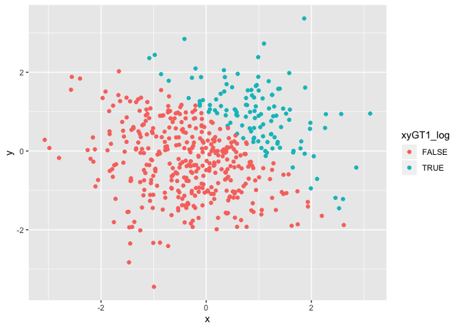
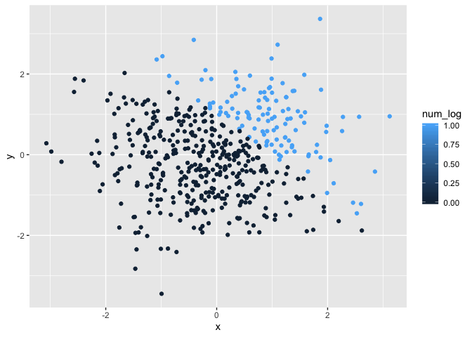
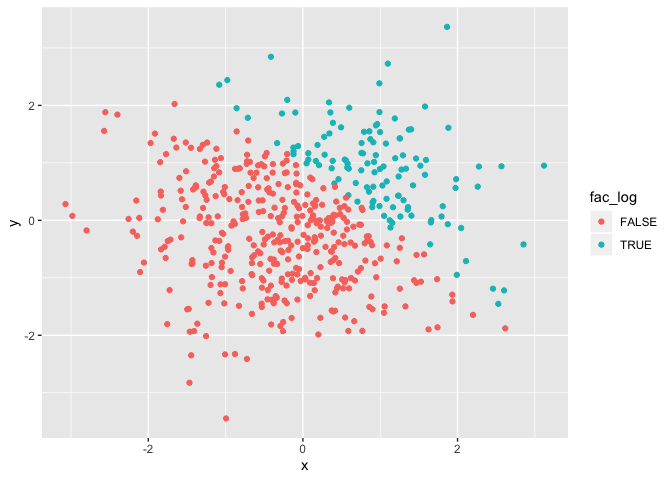

p8105\_hw1\_ah3108
================
Ava Hamilton
9/14/2019

``` r
library(tidyverse)
```

    ## ── Attaching packages ────────────────────────────────────────────────────────────────────────────────────────────────────────── tidyverse 1.2.1 ──

    ## ✔ ggplot2 3.2.1     ✔ purrr   0.3.2
    ## ✔ tibble  2.1.3     ✔ dplyr   0.8.3
    ## ✔ tidyr   0.8.3     ✔ stringr 1.4.0
    ## ✔ readr   1.3.1     ✔ forcats 0.4.0

    ## ── Conflicts ───────────────────────────────────────────────────────────────────────────────────────────────────────────── tidyverse_conflicts() ──
    ## ✖ dplyr::filter() masks stats::filter()
    ## ✖ dplyr::lag()    masks stats::lag()

# Problem 1:

### Create dataframe

``` r
hw1p1_df = tibble(
  rsamp = rnorm(8),
  log_vec = rsamp > 0,
  char_vec = c("a", "b", "c", "d", "e", "f", "g", "h"),
  fac_vec = factor(c("lev1", "lev3", "lev2", "lev2", "lev2", "lev1", "lev3", "lev3"))
  
)
```

### Take mean of variables in dataframe

``` r
mean(pull(hw1p1_df, rsamp))
```

    ## [1] -0.1341728

``` r
mean(pull(hw1p1_df, log_vec))
```

    ## [1] 0.5

``` r
mean(pull(hw1p1_df, char_vec))
```

    ## Warning in mean.default(pull(hw1p1_df, char_vec)): argument is not numeric
    ## or logical: returning NA

    ## [1] NA

``` r
mean(pull(hw1p1_df, fac_vec))
```

    ## Warning in mean.default(pull(hw1p1_df, fac_vec)): argument is not numeric
    ## or logical: returning NA

    ## [1] NA

It was only possible to take the mean of the numeric variable “rsamp”
(mean = -0.134), and the logical variable “log\_vec”, (mean = 0.5).

### Convert variables to numeric

``` r
as.numeric(pull(hw1p1_df, log_vec))
as.numeric(pull(hw1p1_df, char_vec))
as.numeric(pull(hw1p1_df, fac_vec))
```

1.  The logical vector converts to 0s and 1s; able to take the mean of
    0s and 1s in previous step.
2.  The character vector will not convert to a numeric variable; cant
    take the mean in previous step.
3.  The factor variable evaluates the input as a whole and assigns
    numeric values to each category alphabetically; even though
    categories can be numeric, taking the mean of a discrete categorical
    variable organized alphabetically is
    meaningless.

### Manipulate variables

``` r
as.numeric(pull(hw1p1_df, log_vec))*pull(hw1p1_df, rsamp)
```

    ## [1] 0.00000000 1.15447088 0.00140538 0.00000000 0.27419125 0.02434521
    ## [7] 0.00000000 0.00000000

``` r
as.factor(pull(hw1p1_df, log_vec))*pull(hw1p1_df, rsamp)
```

    ## Warning in Ops.factor(as.factor(pull(hw1p1_df, log_vec)), pull(hw1p1_df, :
    ## '*' not meaningful for factors

    ## [1] NA NA NA NA NA NA NA NA

``` r
as.numeric(as.factor(pull(hw1p1_df, log_vec)))*pull(hw1p1_df, rsamp)
```

    ## [1] -0.087545947  2.308941763  0.002810759 -0.160293567  0.548382498
    ## [6]  0.048690424 -1.927482179 -0.352473263

# Problem 2:

### Create dataframe

``` r
hw1p2_df = tibble(
  x = rnorm(500),
  y = rnorm(500),
  xyGT1_log = x + y > 1,
  num_log = as.numeric(xyGT1_log),
  fac_log = as.factor(xyGT1_log)
)
```

### Dataframe description

  - The dataframe hw1p2\_df has 500 rows and 5 columns.
  - The variable x is a random sample from a standard normal
    distribution of size 500. The variable x has a mean of -0.0476647, a
    median of -0.0706519, and standard deviation of 1.0473112.
  - The proportion of cases for which `x + y > 1` is 0.238.

### Scatterplots of y vs x

#### Logical color scale

``` r
ggplot(hw1p2_df, aes(x = x, y = y, color = xyGT1_log)) + geom_point()
```

<!-- -->

#### Numeric color scale

``` r
ggplot(hw1p2_df, aes(x = x, y = y, color = num_log)) + geom_point()
```

<!-- -->

#### Factor color scale

``` r
ggplot(hw1p2_df, aes(x = x, y = y, color = fac_log)) + geom_point()
```

<!-- -->

#### Comments

The color scales for the logical and factor variables are the same. Both
have discrete colors representing the different levels. The color scale
using the numeric vector shows a continuous color scale over the range
of the numeric values, in this case 0 to 1. However, as there are only
two values in the numeric vector, the plot is made up of two colors.
